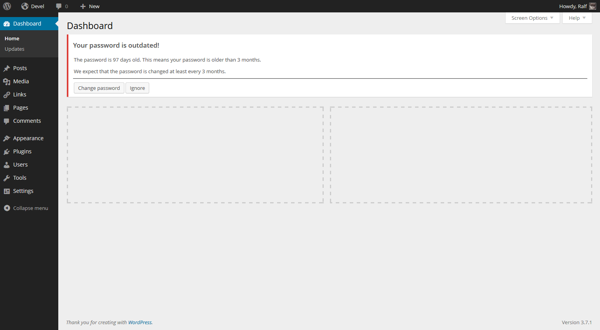
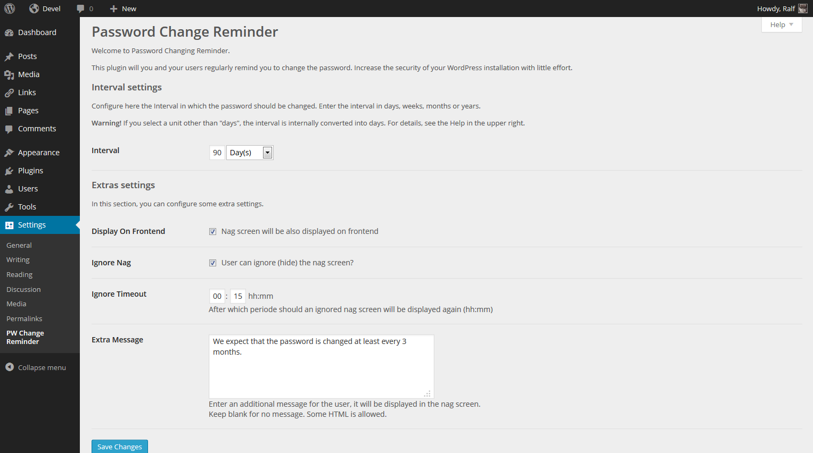
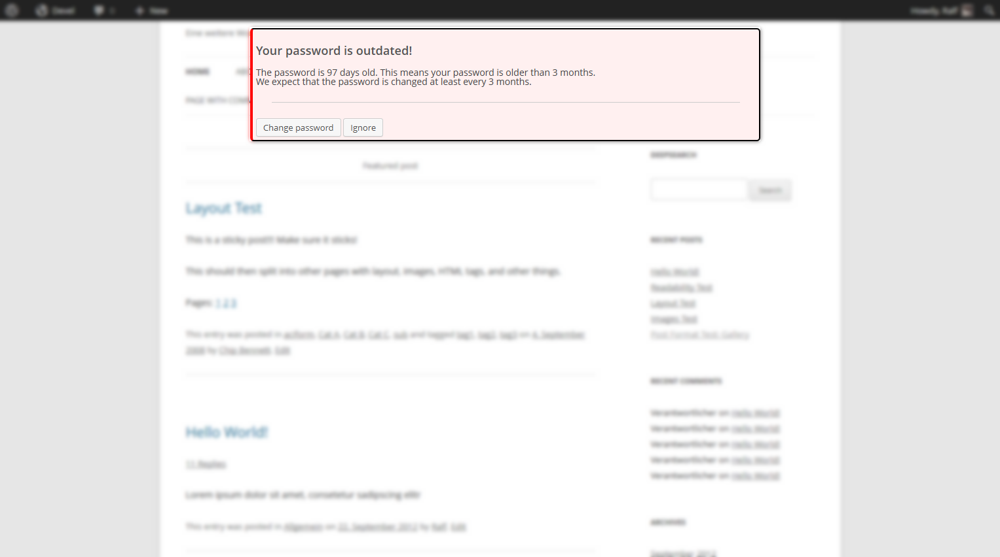

# Password Change Reminder #

**Contributors:** Ralf Albert

## Short Description ##
More security through regularly changing passwords. "Password Change Reminder" reminds the users to regularly change their password.

Password Change Reminder requires PHP v5.3+

## Description ##
Password Change Reminder helps to raise the security of your WordPress installation with little effort. It will remind the users to regularly change their password. If the password is expired, a nag screen reminds the user to change the password.

## Installation ##
1. Search for the plugin name in your admin user interfaces plugin page. Then install it.
2. If needed, adjust the settings under "Settings" » "PW Change Reminder" in the admin user interface.

If you want to install the plugin manually:

1. Download "AvatarPlus" from the WordPress repository
2. Unpack the archive.
3. Upload the unpacked archive folder to your plugins folder.
4. Activate the plugin.
5. If needed, adjust the settings under "Settings" » "PW Change Reminder".

## Changelog ##

### 0.1 ###
* 0.1.20131120 - First commit to GitHub
* 0.1.20131121 - Some optimazation; adding/edit documentation

### 0.2 ###
* 0.2.20131123 - Add nag screen to frontend

## Arbitrary section ##

## Screenshots ##
* Nag screen on backend (with MP6 admin style)

* Settings

* Nag screen on frontend

